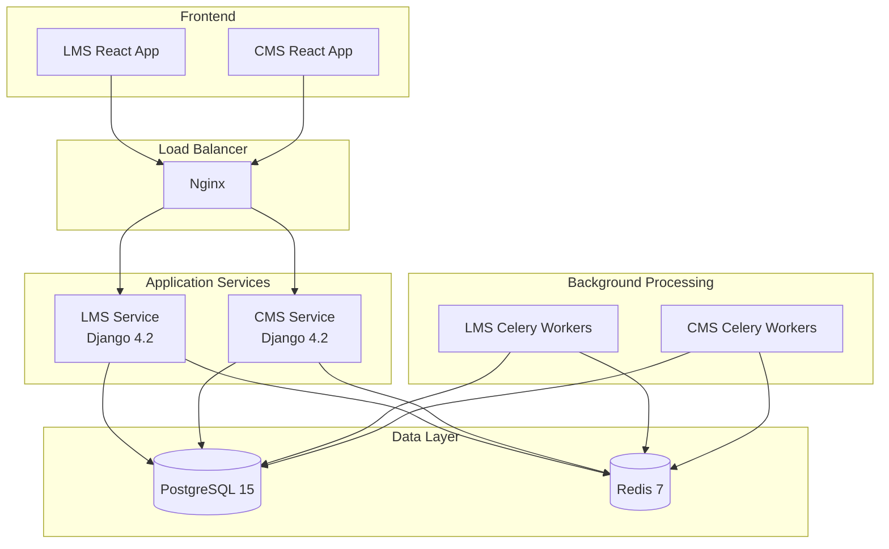
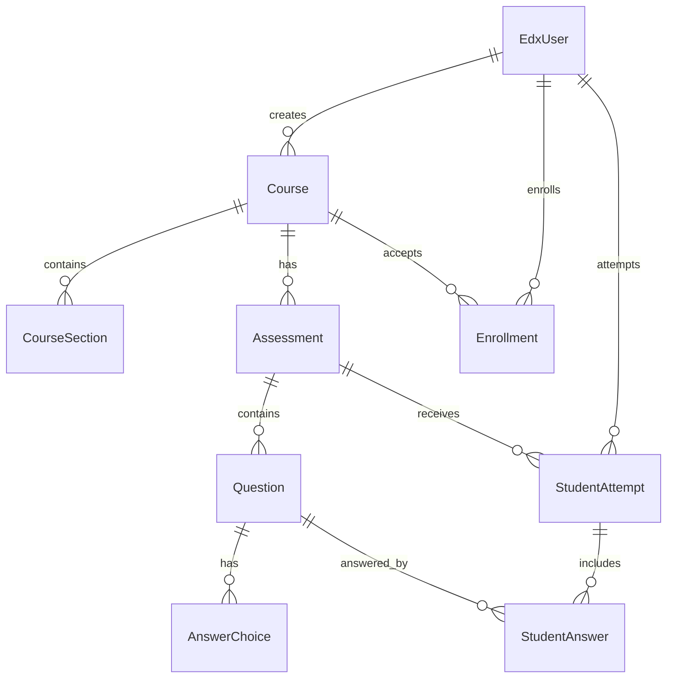

# Modern edX Platform

A modern, scalable implementation of the edX Learning Management System built with Django 4.2, featuring microservices architecture, containerization, and modern development practices.

## 🚀 Features

### Core Platform
- **LMS (Learning Management System)**: Student-facing learning platform
- **CMS (Content Management System)**: Instructor and admin content creation interface
- **Microservices Architecture**: Separate, scalable services
- **Modern Tech Stack**: Django 4.2, PostgreSQL 15, Redis 7, Python 3.11+

### LMS Features
- **User Management**: Student/instructor profiles with role-based access
- **Course Catalog**: Browse, search, and enroll in courses
- **Content Delivery**: Video streaming, documents, interactive content
- **Assessments**: Quizzes, assignments, exams with auto-grading
- **Progress Tracking**: Real-time progress monitoring and analytics
- **Discussion Forums**: Course-specific student discussions
- **Mobile API**: RESTful API for mobile app integration

### CMS Features
- **Course Creation**: Drag-and-drop course builder
- **Rich Content Editor**: TinyMCE integration for multimedia content
- **Assessment Builder**: Create various question types and rubrics
- **Publishing Workflow**: Draft → Review → Publish states
- **Version Control**: Track and revert content changes
- **Collaboration**: Multi-author support with permissions

### Technical Features
- **Containerization**: Docker and Docker Compose
- **Horizontal Scaling**: Kubernetes-ready stateless services
- **Caching**: Redis for session storage and application cache
- **Async Processing**: Celery for background tasks
- **API-First**: Django REST Framework with comprehensive APIs
- **Security**: Modern security practices and HTTPS enforcement

## 📋 Prerequisites

- Docker Desktop 4.0+
- Docker Compose 2.0+
- Git
- 8GB+ RAM recommended

## 🚀 Quick Start

### 1. Clone the Repository
```bash
git clone https://github.com/your-org/modern-edx.git
cd modern-edx
```

### 2. Environment Setup
```bash
# Copy environment template
cp .env.example .env

# Edit .env with your settings (optional for development)
nano .env
```

### 3. Start Development Environment
```bash
# Build and start all services
make setup
make dev

# Or manually:
docker-compose up -d --build
```

### 4. Initialize Database
```bash
# Run migrations
make migrate

# Create superuser accounts
make superuser
```

### 5. Access the Platform
- **LMS**: http://localhost:8000
- **CMS**: http://localhost:8001
- **Admin Panel**: http://localhost:8000/admin

## 🛠 Development

### Available Commands
```bash
# Environment management
make setup          # Initial project setup
make dev            # Start development environment
make stop           # Stop all services
make restart        # Restart all services

# Database operations
make migrate        # Run database migrations
make shell          # Open Django shell
make superuser      # Create superuser

# Testing and quality
make test           # Run all tests
make coverage       # Run tests with coverage
make lint           # Code linting
make format         # Code formatting

# Monitoring
make logs           # View all service logs
make logs-lms       # View LMS logs only
make logs-cms       # View CMS logs only
make health         # Check service health
```

### Project Structure
```
modern-edx/
├── services/
│   ├── lms/                    # Learning Management System
│   │   ├── lms/               # Django project settings
│   │   ├── apps/              # Django applications
│   │   │   ├── courses/       # Course management
│   │   │   ├── students/      # Student profiles & analytics
│   │   │   ├── instructors/   # Instructor tools
│   │   │   └── assessments/   # Quizzes & assignments
│   │   └── manage.py
│   ├── cms/                   # Content Management System
│   │   ├── cms/              # Django project settings
│   │   ├── apps/             # Django applications
│   │   │   ├── content/      # Content creation
│   │   │   ├── authoring/    # Authoring tools
│   │   │   └── publishing/   # Publishing workflow
│   │   └── manage.py
│   └── shared/               # Shared modules
│       ├── authentication/   # User models & auth
│       ├── permissions/      # Access control
│       └── utils/           # Common utilities
├── docker/                  # Docker configurations
│   ├── lms/
│   ├── cms/
│   └── nginx/
├── frontend/               # React frontend applications
│   ├── lms-ui/            # LMS user interface
│   └── cms-ui/            # CMS user interface
├── docker-compose.yml     # Development environment
├── Makefile              # Development commands
└── README.md
```

## 🏗 Architecture

### Service Architecture


### Database Schema


## 🔧 Configuration

### Environment Variables
Key configuration options in `.env`:

```bash
# Database
DATABASE_URL=postgresql://user:pass@db:5432/modern_edx
REDIS_URL=redis://redis:6379/0

# Django
SECRET_KEY=your-secret-key
DEBUG=False
ALLOWED_HOSTS=yourdomain.com

# Email
EMAIL_HOST=smtp.gmail.com
EMAIL_HOST_USER=your-email@gmail.com
EMAIL_HOST_PASSWORD=your-app-password

# AWS S3 (Production)
AWS_ACCESS_KEY_ID=your-access-key
AWS_SECRET_ACCESS_KEY=your-secret-key
AWS_STORAGE_BUCKET_NAME=your-bucket-name
```

### Production Deployment

#### Using Docker Compose
```bash
# Production environment
docker-compose -f docker-compose.prod.yml up -d
```

#### Using Kubernetes
```bash
# Apply Kubernetes manifests
kubectl apply -f k8s/
```

## 🧪 Testing

### Running Tests
```bash
# All tests
make test

# Specific service
make test-lms
make test-cms

# With coverage
make coverage
```

### Test Structure
- **Unit Tests**: Model and utility function tests
- **Integration Tests**: API endpoint tests
- **Functional Tests**: End-to-end user workflow tests

## 🔐 Security

### Security Features
- **Authentication**: JWT tokens with refresh
- **Authorization**: Role-based access control
- **Data Protection**: Encrypted sensitive data
- **HTTPS**: Enforced SSL/TLS
- **CSRF Protection**: Django CSRF middleware
- **SQL Injection**: Django ORM protection
- **XSS Protection**: Content Security Policy

### Security Headers
- X-Frame-Options: DENY
- X-Content-Type-Options: nosniff
- X-XSS-Protection: 1; mode=block
- Strict-Transport-Security
- Content-Security-Policy

## 📈 Performance

### Optimization Features
- **Database**: Connection pooling, query optimization
- **Caching**: Redis for sessions, API responses, static content
- **Static Files**: CDN integration with WhiteNoise
- **Compression**: Gzip compression for responses
- **Async Processing**: Celery for heavy operations

### Monitoring
- Health check endpoints: `/health/` and `/health/detailed/`
- Application metrics via Django extensions
- Database query monitoring
- Error tracking with Sentry (optional)

## 🤝 Contributing

### Development Setup
1. Fork the repository
2. Create a feature branch: `git checkout -b feature/amazing-feature`
3. Make your changes
4. Run tests: `make test`
5. Run linting: `make lint`
6. Commit changes: `git commit -m 'Add amazing feature'`
7. Push to branch: `git push origin feature/amazing-feature`
8. Open a Pull Request

### Code Standards
- Python: PEP 8 compliance
- Django: Follow Django best practices
- JavaScript: ESLint configuration
- Git: Conventional commit messages

## 📚 API Documentation

### Authentication
```bash
# Login
POST /api/v1/auth/login/
{
  "email": "user@example.com",
  "password": "password"
}

# Register
POST /api/v1/auth/register/
{
  "username": "user",
  "email": "user@example.com",
  "password": "password",
  "first_name": "John",
  "last_name": "Doe"
}
```

### Courses
```bash
# List courses
GET /api/v1/courses/

# Course details
GET /api/v1/courses/{id}/

# Enroll in course
POST /api/v1/courses/{id}/enroll/
```

### Assessments
```bash
# Course assessments
GET /api/v1/courses/{id}/assessments/

# Submit assessment
POST /api/v1/assessments/{id}/submit/
```

## 🆘 Troubleshooting

### Common Issues

#### Services won't start
```bash
# Check logs
make logs

# Rebuild containers
docker-compose down
docker-compose up --build
```

#### Database connection errors
```bash
# Reset database
docker-compose down -v
docker-compose up -d db
make migrate
```

#### Permission errors
```bash
# Fix file permissions
sudo chown -R $USER:$USER .
```

### Health Checks
```bash
# Check service health
curl http://localhost:8000/health/
curl http://localhost:8001/health/

# Detailed health check
curl http://localhost:8000/health/detailed/
```

## 📄 License

This project is licensed under the AGPL-3.0 License - see the [LICENSE](LICENSE) file for details.

## 🙏 Acknowledgments

- **Original edX Platform**: Inspiration and reference architecture
- **Django Community**: Framework and ecosystem
- **Open Source Contributors**: Libraries and tools used

## 📞 Support

- **Documentation**: [Wiki](https://github.com/your-org/modern-edx/wiki)
- **Issues**: [GitHub Issues](https://github.com/your-org/modern-edx/issues)
- **Discussions**: [GitHub Discussions](https://github.com/your-org/modern-edx/discussions)
- **Email**: support@modern-edx.com

---

**Modern edX Platform** - Building the future of online education 🎓
